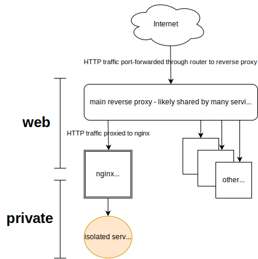

# Docker service isolation demo

Demonstrates web service network isolation using only Docker Compose.

This will:

* Stand up a `whoami` service.
* Allow proxied access to the service.
* Block all outbound access from the service.

`whoami` is a stand-in for any service that doesn't need outbound (e.g. Internet) access.

## Description



The isolated service receives network traffic via an intermediate Nginx server named `whoami-proxy`.
`whoami-proxy` straddles the Traefik-aware `web` network and the [externally isolated](https://docs.docker.com/reference/compose-file/networks/#internal) `private` network.

The service cannot send traffic beyond `private`.

## Walkthrough

To test this, start up everything and tail logs with

```bash
docker compose up
```

This starts up four containers.

1. `main-rproxy` - Traefik. Highly trusted, kept up to date, etc. Imagine this service exposed on a WAN (via a router port-forwarding to it). Excludes HTTPS for simplicity. [Source](https://github.com/traefik/traefik/).
1. `whoami-proxy` - Nginx. A trustworthy internal / 2nd proxy for isolating the `whoami` service, our stand-in for an untrusted or less-trustworthy service. Gatekeeper straddling the `web` and `private` networks. [Source](https://github.com/nginxinc/docker-nginx).
1. `whoami` - Simulated untrusted or less-trustworthy service. [Source](https://github.com/traefik/whoami).
1. `jailed-worker` - Simulated companion/sidecar to the untrusted or less-trustworthy service. Exists to provide a network sandbox for testing because `whoami` is a refreshingly minimal image (without even a shell). [Source](https://github.com/nicolaka/netshoot).

In a separate terminal, try:

```bash
curl -v http://whoami.docker.localhost
```

## Experiment further

To test network activity within the `private` (isolated) network, run

```bash
docker compose exec jailed-worker bash
```

Now you're in a [netshoot](https://github.com/nicolaka/netshoot) container. Try:

```bash
# should succeed
ping whoami

# should fail outright / hang
ping web

# DNS query should work, actual ping should hang
ping adammonsen.com
```

## See also

* [filter outbound container network traffic : r/selfhosted](https://www.reddit.com/r/selfhosted/comments/1f5vqqn/filter_outbound_container_network_traffic/)
* [Restrict Internet Access - Docker Container - Stack Overflow](https://stackoverflow.com/questions/39913757/restrict-internet-access-docker-container)
* [Preventing egress / outbound traffic from container, except via sidecar gateway/proxy - Nomad - HashiCorp Discuss](https://discuss.hashicorp.com/t/preventing-egress-outbound-traffic-from-container-except-via-sidecar-gateway-proxy/56488)
* [linux - Docker: Restricting inbound and outbound traffic using iptables - Unix & Linux Stack Exchange](https://unix.stackexchange.com/questions/628827/docker-restricting-inbound-and-outbound-traffic-using-iptables)
* [Restrict Internet Access - Docker Container - Stack Overflow](https://stackoverflow.com/questions/39913757/restrict-internet-access-docker-container)

## FAQ

Why?
: I wanted a way to block outbound traffic from containers without modifying images and without having to work with iptables.

Why Traefik?
: Just happens to be something I'm familiar with.

Why Nginx?
: It's a popular reverse proxy and it looked easy to set up. It was.

Why not iptables?
: Looks hard. I'm not super confident with it.

What about web sockets?
: I don't know. Maybe that'll work as-is, or with a few more lines of Nginx config?

What about HTTPS?
: I was assuming Traefik would terminate HTTPS traffic, so Nginx and the isolated service shouldn't need to handle that.

How do I get real client IP addresses?
: I don't know. Should be doable with the right headers.

## Copyright and license

This demonstration is (C)2024 Adam Monsen.
Some rights reserved.
License is [Creative Commons Attribution-ShareAlike 4.0 International (CC BY-SA 4.0) License](https://creativecommons.org/licenses/by-sa/4.0/).
