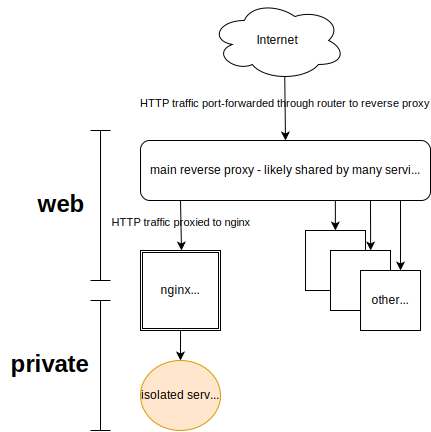

# ✅ Attempt 3



The isolated service receives network traffic via an intermediate Nginx server named `whoami-proxy`.
`whoami-proxy` straddles the Traefik-aware `web` network and the [externally isolated](https://docs.docker.com/reference/compose-file/networks/#internal) `private` network.

The service cannot send traffic beyond `private`.

## Walkthrough

To test this, start up everything and tail logs with

```bash
docker compose up
```

This starts up four containers.

1. `main-rproxy` - Traefik. Highly trusted, kept up to date, etc. Imagine this service exposed on a WAN (via a router port-forwarding to it). Excludes HTTPS for simplicity. [Source](https://github.com/traefik/traefik/).
1. `whoami-proxy` - Nginx. A trustworthy internal / 2nd proxy for isolating the `whoami` service, our stand-in for an untrusted or less-trustworthy service. Gatekeeper straddling the `web` and `private` networks. [Source](https://github.com/nginxinc/docker-nginx).
1. `whoami` - Simulated untrusted or less-trustworthy service. [Source](https://github.com/traefik/whoami).
1. `jailed-worker` - Simulated companion/sidecar to the untrusted or less-trustworthy service. Exists to provide a network sandbox for testing because `whoami` is a refreshingly minimal image (without even a shell). [Source](https://github.com/nicolaka/netshoot).

In a separate terminal, try:

```bash
curl -v http://whoami.docker.localhost
```

## See also

* Experiment further in `../Readme.md`
